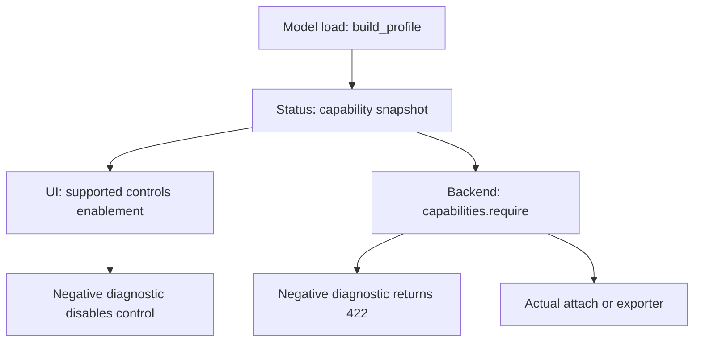
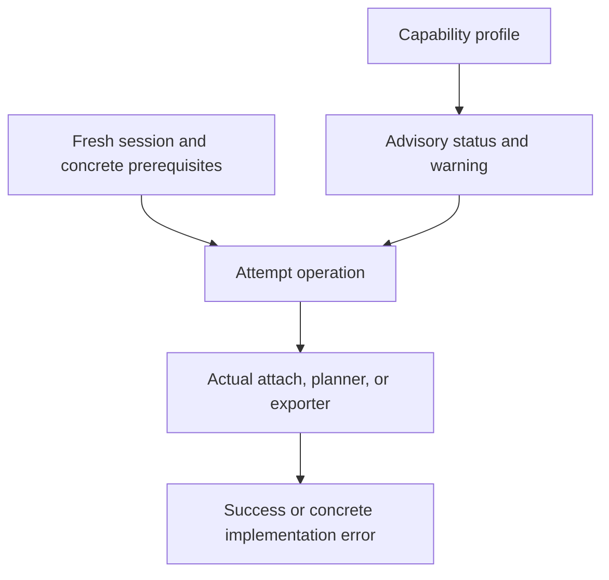

# PR #12 implementation plan: Make model capability checks advisory

## 1. Executive recommendation

Implement PR #12 as a policy inversion, not as a topology-expansion PR:

> Capability metadata reports positive validation confidence and canonical warnings. It never grants or denies permission. A coherent operation is attempted, and the operation's real implementation is the final arbiter.

Concretely:

- Remove every production use of `capabilities.require(...)`.
- Stop deriving UI enablement from `decision.supported`.
- Keep `/api/status`, canonical reasons, packed-MoE facts, quantization facts, topology diagnostics, and legacy advisory aliases.
- Separate diagnostic validity from model-session freshness. Missing or malformed diagnostics must show an advisory warning but must not disable a fresh, coherent loaded session.
- Preserve every PR #11 coordinator, cancellation, transaction, status-ordering, editor-lifetime, and publication invariant.
- Keep deep `rebase.model_preflight(...)` checks when Readthrough/Exact is actually attached or exported. At that point the check is the current transform planner, not a permission preflight.
- Replace declaration-based `ensure_unquantized(...)` authorization with the narrow tensor/module checks required by the operation that is actually running.
- Make Global Projection selectable. Its live implementation is currently absent, and its dormant exporter is not safe to publish. Let attempts reach those implementation seams and return concrete implementation errors; do not return `global_projection_unvalidated` as an authorization denial.
- Keep unknown identifiers, no-model/no-lens conditions, busy/session conflicts, missing active rules, invalid names, missing llama.cpp tools, and unsafe publication conditions as hard failures.

This plan intentionally does **not** add dense Qwen3.5 or Qwen3.6 topology support. Dense Qwen3.5-27B is the first acceptance model because it should expose the next concrete transform error after the policy barriers are removed.

## 2. Repository identity and exact planning base

| Item | Exact value |
|---|---|
| Repository | `erm14254/J-Wash` |
| Planning base | `ca343a5cb02dcd191433912d92c087124149910c` |
| Base commit | `Make editor and export controls capability-aware (#11)` |
| Base branch at audit time | `master` |
| Proposed branch | `maintenance/advisory-model-capabilities` |
| Proposed PR title | `Make model capability checks advisory` |

The audit was performed against a clean checkout whose `HEAD` and `origin/master` both resolved to the exact SHA above. All references below are base-SHA line numbers.

## 3. Current blocking architecture map

At the base SHA, the same strict profile is used first as a diagnostic and then again as authorization:

This means dense Qwen3.5 never reaches the relevant transform because it is absent from `AUDITED_DECODER_SPECS`, even though an attempted transform could provide a much more useful error.

The target architecture is:

Important current facts:

- `core/rebase.py:336-360` has exact decoder specs only for `LlamaDecoderLayer` and `Qwen3_5MoeDecoderLayer`.
- Dense Qwen3.5 is absent from that table.
- Dense Qwen3.5 RMSNorm semantics are nevertheless recognized at `core/rebase.py:372-379`; the first failure is decoder topology selection, not RMS mathematics.
- `core/capabilities.py:105-138` catches inventory failure and converts it into a negative diagnostic.
- Backend `require(...)` calls and frontend `decision.supported` checks turn that diagnostic into a prohibition before the actual operation runs.

## 4. Complete inventory of capability-derived authorization gates

### 4.1 Advisory policy gates to remove

| Current locus | Current behavior | PR #12 action |
|---|---|---|
| `api/app.py:1493`, `_interventions_add_resource` | Requires positive Standard capability before adding a rule. | Remove the `require`; retain loaded model, lens, input, tensor, and transaction checks. |
| `api/app.py:1545-1550`, `_interventions_patch_resource` | Requires positive Standard capability for direction, factor, re-enable, and combined effectful PATCHes. | Remove only capability authorization. Retain `effectful_patch`, `needs_dirs`, loaded ownership, and rollback. |
| `api/app.py:1598-1608`, `_interventions_scale_resource` | Requires a positive capability decision for the requested mode. | Remove the `require`. Validate loaded-session presence separately and let `Interventions.set_scale_and_mode` reject unknown strings. |
| `api/app.py:1810`, `_presets_apply_resource` | Requires positive Standard capability before preset mutation. | Remove; retain model/lens prerequisites, provenance warnings, per-rule validation, and transactionality. |
| `api/app.py:1961`, `_export_preflight_resource` | Rejects Full/Layers/LoRA before selecting or invoking the exporter. | Remove; dispatch to the selected exporter. |
| `api/app.py:2002`, `_gguf_preflight_resource` | Rejects GGUF bake before the actual exporter. | Remove; let the full-checkpoint bake and converter paths run or fail concretely. |
| `core/model_manager.py:739-747`, `ModelManager.generate` | Rejects captured active rules before `ablator.attach(...)`. | Remove the capability block. Preserve the captured context and call `attach`. |
| `core/ablation.py:427-428`, `Interventions.attach` | Unconditionally rejects Abliteration before checking active rules. | Check active rules first; dispatch active Global Projection to its real stub/implementation. |
| `core/ablation.py:466-468`, `_attach_abliteration` | Returns the advisory `global_projection_unvalidated` reason as a hard failure. | Replace with a concrete live-implementation error while the function remains a stub. |
| `core/editing.py:1109-1112`, `compute_abliteration` | Declaration guard plus unconditional advisory rejection hides the dormant transform. | Do not use the advisory reason as authorization. Keep a concrete safety/incompleteness error until targeted tensor checks and safe execution are ready. |
| `core/editing.py:1208-1211`, `export_abliteration` | Declaration guard plus unconditional advisory rejection hides dormant export code. | Let route dispatch reach this function, then return a concrete implementation-safety error unless the must-fix hardening in section 10 is completed. |
| `core/editing.py:1685-1699` plus `core/model_manager.py:618-624` | Cached `has_packed_read_parameters` diagnostic metadata can independently reject Layers/LoRA. | Use the fresh operation-time inventory/targets for the hard decision; keep cached metadata only for diagnostics. |
| `ui/src/capabilityState.js:38` | Mode enablement requires `decision.supported`. | Derive enablement only from fresh loaded-session mechanics and busy/transition state. |
| `ui/src/capabilityState.js:42-50` | Effectful editing requires Standard and selected-mode support; negative reasons become blockers. | Remove diagnostic booleans from enablement and blocking-reason selection. |
| `ui/src/capabilityState.js:59-60` | Export `serverEnabled` and final `enabled` require positive capability. | Rename/remove `serverEnabled`; negative decisions remain warnings only. |
| `ui/src/Editor.jsx:190-195` | Negative mode diagnostics disable radios and render as red denial. | Keep radios enabled when mechanically safe; render canonical reason as amber experimental warning. |
| `ui/src/Editor.jsx:336-339` | Invalid capability diagnostics cancel pending editor work. | Key cancellation to session/mutation readiness, not diagnostic validity. |
| `ui/src/App.jsx:1799-1800` and `ui/src/LensView.jsx:582-587` | Capability denial indirectly disables token-to-editor actions. | Pass only a concrete/session blocking reason; advisory diagnostics do not disable the action. |
| `ui/src/Editor.jsx:796-798` | Export action is disabled through capability-derived `formats[fmt].enabled`. | Remove diagnostic coupling; retain active-rule, name, busy, transition, GGUF job, and known local-tool constraints. |
| `README.md:9-14,196-209` | Documents fail-closed topology checks as feature authorization. | Rewrite as advisory validation coverage and attempt-time implementation behavior. |

After these changes, `rg 'capabilities\.require'` should find no production caller. Prefer deleting `require()` from `core/capabilities.py:171-176`; retaining a generic authorization helper makes regression likely.

### 4.2 Diagnostic producers and consumers to preserve

| Locus | Why it remains |
|---|---|
| `core/capabilities.py:24-159` | Builds strict, canonical, isolated diagnostic decisions and export-format warnings. |
| `core/model_manager.py:482-488,615-629` | Computes and stores the profile without failing model load when topology inventory fails. |
| `api/app.py:1098-1133`, `api_status` | Exposes mode/export diagnostics and legacy aliases. |
| `core/model_session.py` capability-profile fields | Preserve the captured diagnostic snapshot and status reporting; they cease to authorize operations. |
| `scripts/jwash_mcp.py:163` | Uses legacy `rebase_supported` as a mode-selection heuristic, not an API authorization check. Leave unchanged per scope, but record the follow-up risk in section 16. |

### 4.3 Concrete operation-time prerequisites to preserve or narrow

| Operation/check | Classification and required behavior |
|---|---|
| Loaded model | Hard prerequisite for add, effectful model-bound PATCH, mode change, fresh export bake, and generation. Enforce through coordinator acquisition, not capability data. |
| Loaded lens | Hard prerequisite for add, direction recomputation, and preset rule construction. |
| Known intervention mode | `Interventions.MODES` remains authoritative. Unknown strings return 422 and do not mutate scale or mode. |
| Known rule-local mode | `scale`/`replace`, replacement token requirements, token IDs, and layer normalization remain actual rule validation. |
| Active rules | Export requires enabled rules with nonempty layers. Attachment with no active rules is a no-op. |
| Export name and format | Safe, nonempty name; known Full/Layers/LoRA/GGUF identifiers; destination safety; source availability. |
| Standard export representation | No implementation exists. Backend returns its concrete pure-weights-mode error. Section 11 recommends allowing the UI attempt. |
| Readthrough/Exact topology | `rebase.model_preflight(...)` remains the actual transform planner when attachment/export is attempted. |
| Packed Exact | Actual writer implementation is absent; preserve `_deny_known_packed_exact` and fresh-inventory checks after attempt. |
| Packed Layers/LoRA | Preserve actual target/streaming limitations in the exporter, based on current inventory rather than cached diagnostic metadata. |
| Weight/tensor representation | Check the tensor/module actually consumed: rank, shape, floating arithmetic, hookability, storage, key mapping, and completeness. Do not infer impossibility solely from declared quantization. |
| llama.cpp | Known-absent converter/quantizer is a concrete GGUF prerequisite; backend remains authoritative. |
| Global Projection live/export | A concrete implementation or safe-publication path must exist. Until then, attempts fail with explicit implementation errors, not validation-confidence reasons. |

### 4.4 Session/lifecycle safety invariants to preserve

| Invariant | Base locus |
|---|---|
| Exclusive operation ownership and loaded-state checks | `ModelSessionCoordinator.acquire/release` and route acquisition sites |
| Complete intervention rollback if mutation or coordinator publication fails | `api/app.py:1149-1157`, `_run_intervention_transaction` |
| Effectful versus cleanup classification | `api/app.py:1518-1526` |
| Model-transition clear/rollback/session increment | `api/app.py:52-104`; `core/model_manager.py:556-708` |
| Captured model, session, lens, mode, rules, and stop event for generation | `api/app.py:2281-2295`; `core/model_manager.py:717-725` |
| Acquired-snapshot mode comparison and best-effort notification | `api/app.py:1576-1595` |
| Operation handoff, claim, cancellation, total release | `api/app.py:282-710,851-897` |
| Provisional `gen_id`, reader/attachment cleanup, and stale publication suppression | `core/model_manager.py:733-1114` |
| Export/GGUF publication guard and atomic output publication | `api/app.py:1892-1945,2159-2190`; `core/editing.py:1570-1650` |
| GGUF single-job and cache-use latches | `api/app.py:2202-2203,2261-2264` |
| Latest status request wins | `ui/src/statusState.js`; `ui/tests/statusState.test.mjs` |
| Capability mutation active-token barrier and double invalidation/reconciliation | `ui/src/statusState.js`; `ui/src/App.jsx:276-319` |
| API-monitor CONNECTING/close invalidation | `ui/src/App.jsx:337-364` |
| Session-keyed Editor and abortable mutation/timer lifetime | `ui/src/App.jsx:1854-1878`; `ui/src/editorMutationState.js`; `ui/src/Editor.jsx` |
| App-owned export selection | `ui/src/App.jsx:198,1873-1874` |

## 5. Classification rule for every implementation check

Use the following review rule during implementation:

1. If changing only `capability_profile` can change whether otherwise identical work is attempted, the check is an advisory-policy gate and must be removed.
2. If the check examines the model, tensor, module, source artifact, tool, name, or mode actually consumed by the running implementation, it is a concrete operation-time prerequisite and remains.
3. If the check prevents stale mutation, overlapping ownership, partial rollback, late publication, or old-session UI updates, it is a lifecycle invariant and remains unchanged.

The same strict inventory result can have two legitimate roles:

- `build_profile()` catches it and reports a warning: advisory.
- `_attach_rebase()` or an exporter freshly reaches it while attempting work: concrete transform result.

This contextual distinction is the center of PR #12.

## 6. Recommended capability schema semantics

Choose option 1: retain the existing wire schema for compatibility.

- Keep `{ supported, reason_code, reason }`.
- Define `supported: true` as **positively validated/known-supported by the current diagnostic audit**, not “authorized to execute.”
- Define `supported: false` as an advisory warning or known implementation limitation. It is never sufficient by itself to reject a request.
- Keep canonical server reasons; do not create a frontend reason-code policy table.
- Keep legacy `rebase_supported`, `readthrough_supported`, and `exact_supported` as deprecated advisory aliases for this PR.
- Keep strict normalization. Malformed data becomes canonical `capability_data_unavailable`, but that describes diagnostics only.
- Rename local UI concepts from `decision`/`serverEnabled` where useful to `diagnostic`/`diagnosticValidated`.
- Rewrite the module docstring from “strict, fail-closed capability contract” to an explicit advisory contract.

Do not rename the wire field to `validated` in PR #12: that would create avoidable client migration. Do not add a second Boolean: duplicated `supported`/`validated` truth can drift. Documentation, production-call removal, and naming inside the code make the semantics coherent with the smallest API change.

## 7. Backend change plan by file and symbol

### `core/capabilities.py`

1. Rewrite the module and function documentation around advisory diagnostics.
2. Keep `PUBLIC_REASONS`, strict `decision`, `_normalize_decision`, `normalize_profile`, `build_profile`, `snapshot`, and `legacy`.
3. Keep negative quantization, topology, packed, Global Projection, and Standard-export diagnostics.
4. Delete `require()` after removing all callers.
5. Remove `ensure_unquantized()` after replacing its callers with the operation-local checks in section 9.
6. Add comments/tests that `supported` is validation confidence, not permission.

### `api/app.py`

#### Intervention add

- In `_interventions_add_resource` (`1487-1513`), remove `capabilities.require`.
- Keep `requires_loaded=True`, `_bundle_from_snapshot_or_legacy`, the real lens check, `Interventions.add`, and `_run_intervention_transaction`.

#### Effectful PATCH

- Keep `needs_dirs` and `effectful_patch` exactly as safety concepts.
- Keep `requires_loaded=True if effectful_patch else None`.
- Remove the capability check in `_interventions_patch_resource`.
- Resolve the bundle only when `needs_dirs` is true; factor-only and re-enable mutations need a coherent loaded lease but do not need model tensor access.
- Preserve pure disable, delete, and clear as cleanup.
- Prefer a dedicated unknown-rule exception so only missing rules map to 404; actual direction/tensor validation errors should map to 422 rather than the current blanket `ValueError -> 404`.

#### Mode PATCH

- Remove capability lookup/require from `_interventions_scale_resource`.
- Acquire with `requires_loaded=True` when `req.mode is not None`; scale-only behavior can remain unchanged.
- Let `set_scale_and_mode` validate the known mode and commit scale/mode atomically.
- Preserve the acquired-snapshot comparison, session-keyed `capabilities_changed` event, no event for a no-op/rejection, and best-effort notification semantics.

#### Preset apply

- Remove capability and declaration-quantization guards from `_presets_apply_resource`.
- Preserve loaded acquisition, real lens check, stable provenance warnings, per-rule skip warnings, scale application, complete rollback, and coordinated publication.

#### Normal and GGUF export preflight

- Remove both `ensure_unquantized` and `capabilities.require`.
- Preserve active-rule checks, known formats/types, safe name, loaded ownership, selected-mode dispatch, and concrete Standard-mode error.
- Readthrough/Exact dispatch to `editing.export_rebase`; Global Projection dispatches to `editing.export_abliteration`.
- Keep cached GGUF behavior: an existing `hf/config.json` can be converted without a loaded model.
- Pass the `PublicationGate` uniformly to any exporter that can publish. Do not use function identity as a safety switch.

#### Generation

- No route-side capability gate is needed.
- Preserve `_captured_generation_context`, handoff ownership, and captured intervention snapshot.
- Ensure disabled or layer-empty rules do not cause an attachment error. The minimal change is to make `Interventions.attach` return an empty attachment before mode-specific checks.

### `core/model_manager.py`

- Remove the `capabilities.require` block at `739-746`.
- Continue to call `ablator.attach(jl, snapshot=ablator_snapshot)` with the captured snapshot.
- Do not replace captured mode/profile/rules with live global state.
- Preserve all early-failure cleanup, provisional generation cleanup, attachment close, `gen_id` ownership, and last-generation publication logic.
- Continue building/storing the capability profile during load for diagnostics.

### `core/ablation.py`

- Keep `MODES` and `set_scale_and_mode` validation.
- Replace declaration guards in `add`/direction-changing `update` with a shared concrete direction-source validator:
  - real lens exists;
  - `jl._lm_head.weight` is a readable 2-D floating tensor;
  - token rows exist and match residual width;
  - computed directions are finite and normalizable;
  - layer indices resolve against the actual model.
- Factor-only and enable-only update paths must remain tensor-free.
- In `attach`, clone the captured snapshot, compute active rules first, and return `HookAttachment([])` if there are none.
- Standard remains activation-hook-only.
- Readthrough/Exact continue to call `_attach_rebase` and fresh `model_preflight`.
- Global Projection calls `_attach_abliteration`. While the stub remains, raise a concrete message such as `Global Projection live attachment is not implemented` rather than a capability reason.

### `core/rebase.py`

- Preserve `model_inventory`, `model_preflight`, exact packed checks, tensor identity, alias/storage, norm, tie, shape, forward-provenance, and hookability checks.
- Remove declaration-only `ensure_unquantized` from `build_plan`; fresh inventory is the actual prerequisite.
- Rename `_validate_inventory_policy` to `_validate_inventory_integrity` and update its docstring from authorization language to operation-owned inventory validation.
- Make a missing decoder spec actionable: include the exact module/class and state that no read-projection transform adapter is implemented. Dense Qwen3.5 should fail here after an attempt, not at UI/API capability policy.
- Do not add dense Qwen3.5 topology in this PR.

### `core/editing.py`

- Remove declaration-only quantization guards and use actual inventory/source/tensor checks.
- In `_export_rebase_impl_from_inventory`, do not OR cached `model_meta["has_packed_read_parameters"]` into a denial. Use `inventory.packed` and actual non-LoRA targets.
- Keep destination validation, unique staging, artifact lease, atomic rename, publication gate, bounded transforms, source-key checks, complete target application, no-op detection, and packed format errors.
- For Global Projection, follow the scope-safe plan in section 10. Do not expose the dormant body as a successful exporter until it has parity with the rebase publication and completeness contract.

## 8. Frontend change plan by file and symbol

### `ui/src/capabilityState.js`

Refactor `readCapabilityState` into independent axes:

- `diagnosticsValid`: capability entries have the expected wire shape.
- `exportsSynchronized`: export diagnostics correspond to `interventions_mode`.
- `sessionReady`: status is fresh, a model is loaded, `model_session_id` is a coherent integer, and `interventions_mode` is known.
- `operationBlocked`: coordinator busy or a local capability mutation is pending.

Derive behavior as follows:

| UI action | Enablement source |
|---|---|
| Known mode radio | `sessionReady && !operationBlocked` |
| Scale/add/factor/directions/re-enable/preset | `sessionReady && lensAvailable && !operationBlocked` |
| Full/Layers/LoRA export attempt | fresh loaded session, active rules, not blocked |
| GGUF export attempt | same plus known local llama.cpp readiness and no running GGUF job |
| Pure disable/delete/clear/cache cleanup | retain current cleanup rule: not busy and not transition-pending |

Additional details:

- Never include `decision.supported` in enablement.
- Resolve each diagnostic entry independently. One malformed entry uses `FALLBACK_DECISION` without discarding unrelated canonical reasons.
- An export diagnostic mode mismatch invalidates export diagnostics, not the loaded session.
- Change fallback copy to advisory language, for example: `Capability diagnostics are unavailable; this operation has not been validated.`
- Remove `editing.blockingDecision`; expose only mechanical/session blocking reasons.
- Replace `serverEnabled` with `diagnosticValidated` or render from `decision.supported`.
- Keep `activeRuleCount`, refresh event classification, external export selection, and cleanup semantics.

### `ui/src/Editor.jsx`

- Render all four known mode rows directly. The current Advanced disclosure (`179-204`) hides Exact/Abliteration and does not satisfy the acceptance requirement that all known rows are visible. Remove `shouldOpenAdvanced` if it becomes unused.
- Radios remain enabled under negative diagnostics when session mechanics allow.
- Render negative or unavailable diagnostics as `⚠ Experimental: {canonical reason}`.
- Add `aria-describedby` for the advisory text even when the radio is enabled.
- Render mechanical disable reasons separately from advisory warnings.
- Change the pending-write reset at `336-339` to react to `sessionReady`/session turnover, not `diagnosticsValid`.
- Existing action props then unlock scale, add, factor, layer/direction edit, re-enable, and preset apply without component-specific policy.
- Export format radios remain selectable.
- The Export button no longer depends on diagnostic support. Section 11 recommends allowing Standard to reach the concrete backend error.
- Remove the unused `llamaCppSet` prop if confirmed unused.

### `ui/src/LensView.jsx`

- No new capability logic is needed.
- `editAvailable` must represent mechanical editor readiness only.
- Tooltip/ARIA blocking text must be a session, model/lens, busy, or transition reason—not an advisory capability reason.

### `ui/src/App.jsx`

- Preserve latest-request status application, invalidation, mutation latch, API-monitor socket handling, and `capabilityMutation` around mode changes.
- Continue session-keying `Editor`.
- Continue owning `exportFmt` outside `Editor` so selection survives session turnover.
- Pass a tri-state llama.cpp setting to the adapter:
  - `true`: configured;
  - `false`: settings loaded and explicitly empty, so GGUF is locally blocked;
  - `null`: settings unavailable/in flight, so allow the attempt and let backend path validation decide.
- Stop passing `editing.blockingDecision` to LensView.

### `ui/src/styles.css`

- Keep red for concrete errors.
- Add an amber `.cap-advisory` state for experimental/negative diagnostics.
- Keep `.cap-local` for mechanical prerequisites and refresh/busy messages.
- Preserve selected-row styling; a selected experimental mode is valid UI state.

## 9. Quantization-guard audit

The current `ensure_unquantized` guard is declaration-based. It can reject a usable floating tensor because metadata says `int8`/`nf4`, and it can miss an undeclared custom packed representation. Replace it with checks on what the real operation consumes.

| Current call | Current role | Recommendation |
|---|---|---|
| `api/app.py:1811`, preset apply | Broad policy | Remove; each rule validates actual direction inputs. |
| `api/app.py:1960`, normal export preflight | Broad policy before exporter | Remove; dispatch exporter. |
| `api/app.py:2001`, GGUF preflight | Broad policy before bake | Remove; dispatch bake/exporter. |
| `core/ablation.py:288-289`, add | Blocks Standard direction construction by metadata | Replace with actual 2-D floating `lm_head`, token, width, and finite-direction checks. |
| `core/ablation.py:331-332`, direction update | Same | Use the same actual direction-source validator. |
| `core/ablation.py:423-424`, attach | Blocks every mode, including activation-only Standard | Remove. Standard uses stored directions; Readthrough/Exact use fresh planner checks. |
| `core/editing.py:1109-1110`, Global compute | Hides a real logical-matrix requirement | Replace with per-target readable floating matrix/rank/axis checks. |
| `core/editing.py:1208-1209`, Global export | Redundant policy | Remove once concrete exporter safety checks own the failure. |
| `core/editing.py:1612-1613`, public rebase export | Blocks before actual inventory | Remove; `model_preflight` and source/tensor checks decide. |
| `core/editing.py:1664-1665`, private rebase implementation | Redundant | Remove; retain format and fresh inventory validation. |
| `core/rebase.py:1206-1207`, `build_plan` | Declaration preflight | Remove; `model_preflight` is the actual plan prerequisite. |

Expected nuanced behavior:

- Standard live editing can work on a quantized load when the unembedding remains an ordinary floating matrix.
- Standard attachment needs hookable layer outputs and stored directions, not mutable weights.
- Readthrough/Exact live hooks are activation-only, but the current shared inventory will commonly reject bitsandbytes replacement modules at the actual planner. That concrete result is acceptable.
- Rebase Layers/LoRA use loaded `state_dict()` tensors and must reject representations they cannot transform.
- Rebase Full streams original source safetensors, so load-time quantization is not intrinsically proof that the bake cannot work.
- Global Projection currently consumes loaded logical matrices and must fail on genuinely packed/nonfloating targets.

Test both sides: declared quantization alone does not deny an otherwise workable fake representation; genuinely unusable tensors still fail before mutation or publication.

## 10. Global Projection / Abliteration audit

### Current reality

- Diagnostic metadata always reports `global_projection_unvalidated`.
- Live `_attach_abliteration` is a literal stub.
- `compute_abliteration` and `export_abliteration` contain dormant code after unconditional policy raises.
- That dormant exporter is not publication-safe:
  - it writes directly to the final directory with `exist_ok=True`;
  - it has no sibling staging directory, artifact lease, existing-destination rejection, or atomic publication;
  - workers pass `PublicationGate` only to `export_rebase`;
  - it targets only `self_attn.o_proj` and `mlp.down_proj`, missing `linear_attn.out_proj` and unknown residual writers;
  - Full export lacks `_disk_mapper`, despite Qwen3.5 in-memory/on-disk prefix differences;
  - it does not prove that every intended transformed key was applied;
  - it can therefore report success for an unchanged or partial checkpoint;
  - it materializes all edited matrices at once rather than using bounded streaming.

### PR #12 behavior

1. Mode PATCH to Abliteration succeeds for a coherent loaded session, irrespective of its advisory diagnostic.
2. With no active rules, generation attaches nothing and proceeds normally.
3. With active rules, generation calls `_attach_abliteration`.
4. Because live attachment is not implemented, it returns a concrete attempt-time error such as `Global Projection live attachment is not implemented`.
5. Export preflight dispatches to `export_abliteration`, proving the diagnostic did not deny the attempt.
6. Scope-safe recommendation: until the dormant exporter is transactionally staged and verifies checkpoint mapping/completeness, return a concrete 422 such as `Global Projection export is not safely implemented: transactional publication and target verification are incomplete`.
7. Keep the advisory diagnostic negative; do not claim preview/export fidelity.

If maintainers choose to activate the dormant exporter inside PR #12, all of the following become must-fix in the same PR:

- extract a pure implementation that writes only to a unique staged directory;
- reject existing destinations;
- cover the stage with `artifact_lease`;
- accept and honor `PublicationGate` for normal export and GGUF bake;
- map in-memory keys to disk keys;
- verify every planned target was transformed exactly once;
- fail before publication on missing/ambiguous targets;
- preserve partial-hybrid warnings without converting missing required targets into false success;
- add cancellation-before-rename, cleanup, existing-destination, Qwen prefix, completeness, and no-partial-publication tests.

Do not simply delete the early raises.

## 11. Standard-export audit

Standard is different from an unvalidated architecture:

- Standard applies a residual hook after selected layer outputs.
- There is no `editing.export_standard`.
- The current pure-weight exporters cannot faithfully encode the skip/residual contribution.
- Backend mode dispatch already has a concrete 422 explaining this at `api/app.py:1968-1974` and `2007-2008`.

Recommendation for PR #12: keep every format row selectable **and allow the Export click to reach the backend**. The backend then returns the concrete “no faithful pure-weights representation” error.

Tradeoff:

- Disabling the button avoids a guaranteed failing click.
- Allowing the attempt is the smallest coherent advisory change, avoids reusing `supported` as permission, requires no frontend reason-code table or new schema field, and keeps the backend as final arbiter.

If maintainers later want a hard UI restriction, add a separate server-owned `attemptable`/implementation-availability field. Do not infer it from `supported` or special-case reason codes in the frontend.

## 12. Exact behavior matrix before and after

| Scenario | Base SHA behavior | PR #12 behavior | Final arbiter |
|---|---|---|---|
| Dense unvalidated model, mode rows | Readthrough/Exact/Global disabled. | All four known modes visible and selectable when session is fresh and idle; warnings remain. | Mode identifier and session mechanics. |
| Negative mode PATCH | `capabilities.require` returns 422. | Mode commits; status/event reconciliation runs. | `Interventions.set_scale_and_mode`. |
| Unknown mode string | 422. | Still 422; no partial scale/mode mutation or event. | Known-mode validation. |
| Mode change with no model | Implicit capability 422. | Explicit loaded-session 422. | Coordinator/model state. |
| Add rule under malformed/negative profile | Capability 422. | Actual add is attempted. | Lens, head tensor, token, layers, direction computation. |
| Factor/re-enable/direction PATCH | Capability may reject before mutation. | Attempted under coherent loaded lease; cleanup distinction remains. | Actual rule validation and transaction. |
| Pure disable/delete/clear | Available independently. | Unchanged. | Busy/transition and transaction safety. |
| Preset under malformed/negative profile | Capability 422. | Actual per-rule construction is attempted; warnings/rollback retained. | Model/lens/tensor/rule validation. |
| Generation with active unvalidated Readthrough/Exact | Rejected before `attach`. | `attach` and `model_preflight` are reached. | Fresh topology planner/hook plan. |
| Generation with inactive rules | Capability path can still reach broad attach guards. | Empty attachment; normal generation. | Active-rule semantics. |
| Abliteration selection | Disabled/rejected. | Selectable and committed. | Known mode/session. |
| Abliteration generation | Advisory policy error. | Concrete live-implementation error after attach dispatch. | `_attach_abliteration`. |
| Negative Readthrough/Exact Full export | Preflight capability 422. | Exporter invoked; may succeed or return concrete topology/source/tensor error. | `export_rebase` and fresh inventory. |
| Packed Exact | Disabled/preflight denied. | Selectable; actual attach/export returns packed-writer error. | Actual exact planner. |
| Packed Layers/LoRA | Disabled by snapshot. | Attempted; actual target/streaming limitation errors. | Fresh exporter inventory. |
| Declared quantization with usable Standard head | UI/backend policy denial. | Standard add/live hook may proceed. | Actual head/direction/hook representation. |
| Genuinely unusable quantized tensor | Policy denial. | Concrete tensor/module failure at operation time. | Targeted representation checks. |
| Missing/malformed diagnostics, fresh loaded session | UI editor/export unusable; backend `require` rejects. | Fallback advisory is shown; operations remain available. | Session mechanics and real implementation. |
| Stale status, mutation pending, busy, session turnover | Blocks unsafe writes. | Unchanged. | PR #11 lifecycle state. |
| Standard export | Capability denial shadows route error. | Attempt allowed; backend returns concrete no-representation error. | Mode-to-export implementation dispatch. |
| Missing llama.cpp | Local/backend prerequisite. | Keep known-absent local block; unknown settings allow attempt; backend validates path/tools. | `_llamacpp_paths` and requested GGUF type. |
| Global export | Policy denial. | Exporter seam reached; concrete safety-incomplete error unless fully hardened. | Safe exporter implementation contract. |

## 13. Regression test plan

### `tests/test_capability_contract.py`

- Keep profile normalization, canonical reasons, decision isolation, and legacy-alias consistency as diagnostic tests; rename fail-closed/authorization language.
- Remove tests whose only assertion is that `capabilities.require` rejects.
- Add an invariant/test scan that production code has no `capabilities.require` caller.
- Replace `test_global_mode_is_rejected_by_mode_and_export_apis`:
  - Abliteration PATCH commits;
  - export reaches an `export_abliteration` seam;
  - its concrete safety error propagates without publication.
- Rewrite direction/effectful/preset tests at base lines `330-345`, `365-381`, and `407-426`:
  - negative or malformed diagnostics do not deny the mutation;
  - injected actual failure still restores the full prior record.
- Keep unknown-rule 404 and cleanup tests.
- Parameterize mode PATCH over Readthrough, Exact, and Abliteration negative diagnostics.
- Add no-model and unknown-mode negative cases with no event/no partial mutation.
- Rewrite generation tests at `454-551`:
  - missing/negative profile calls `Ablator.attach` exactly once;
  - a sentinel topology error from attach propagates verbatim;
  - a successful fake attach reaches the normal tokenizer seam;
  - captured selected mode remains the mode used;
  - inactive rules are a no-op.
- Split quantization tests:
  - declared `nf4/int8` plus a usable floating head can add/attach Standard;
  - wrong-rank/nonfloating head fails transactionally;
  - declared quantization reaches mocked planner/exporter;
  - an actual packed/nonfloating target fails before publication.
- Add export-preflight tests for negative and missing diagnostics that assert the selected exporter is invoked.
- Assert a concrete exporter `ValueError` becomes 422 and no artifact is falsely reported.

### `tests/test_lifecycle.py`

- Update `test_mode_notification_is_exact_and_scale_or_rejection_emit_none`:
  - Abliteration now commits and emits one session-keyed event;
  - repeated same-mode and scale-only operations emit none;
  - use an unknown mode for rejection/no-event coverage.
- Preserve load, unload, failed replacement, failed unchanged-session load, scheduling-failure, and acquired-snapshot event tests unchanged.

### `tests/test_gguf_workers.py`

- Replace `test_fresh_gguf_bake_requires_capability_profile` with proof that a missing profile reaches `export_rebase`.
- Replace the pre-dispatch Abliteration capability rejection with exporter-seam invocation and concrete error cleanup.
- Add negative-architecture profile coverage.
- Preserve no-active-rule owner release.
- Preserve converter/quantizer validation, atomic temporary publication, retry, cache reuse, and cleanup tests.
- Add tri-state expectations at the adapter boundary; backend path validation stays covered separately.

### `tests/test_operation_coordination.py` and transactional export tests

- Preserve all existing handoff, cancellation, heavy-resource release, generation provenance, stale-session, publication-gate, and rollback tests.
- If Global export is activated, add publication-guard parity for both normal and GGUF workers plus stage cleanup and target-completeness coverage.
- Even if it remains concretely unavailable, add a test that its failure releases the exact coordinator owner and publishes nothing.

### `ui/tests/capabilityState.test.mjs`

- Split “malformed and stale fail closed” into:
  - fresh loaded session plus malformed/missing diagnostics remains operational with fallback advisory;
  - stale status still blocks effectful modes/edit/export.
- Add the dense-unvalidated fixture from the acceptance scenarios:
  - all four modes enabled and visible in the view model;
  - selected negative mode remains selected;
  - effectful editor actions enabled with a lens;
  - canonical reasons preserved.
- Assert negative export diagnostics do not disable an attempt.
- Assert no-model, busy, transition, invalid session ID, and unknown selected mode remain blocked.
- Assert export diagnostic mode mismatch affects warnings only, not session readiness.
- Keep active-rule counting, cleanup-under-stale-status, refresh-event classification, external export selection, status-latch, and editor-cancellation tests.
- Add GGUF cases for configured, known-unconfigured, and unknown settings.
- Remove `shouldOpenAdvanced` tests if all four rows render directly.

### UI integration validation

- Use Node adapter tests for warning kind/text and enablement.
- Run the existing complete Node suite.
- Run the Vite production build to validate JSX/CSS integration.
- Do not add a frontend reason-code table or a new component-test stack solely for this PR.

## 14. Real-model Qwen3.5-27B acceptance procedure

Use dense Qwen3.5-27B as the first runtime acceptance model. Record model ID, exact model revision, PR head SHA, dtype/quantization, device mapping, lens identity, and `/api/status.model_session_id`.

1. Load the model and a usable lens; wait for a fresh idle status.
2. Capture `/api/status` and confirm the expected diagnostics:
   - Standard positively validated;
   - Readthrough `architecture_unsupported`;
   - Exact `architecture_unsupported`;
   - Global Projection `global_projection_unvalidated`;
   - export warnings derived from the selected mode.
3. Verify all four mode rows are visible. Readthrough, Exact, and Global Projection must be selectable and must show amber canonical warnings.
4. Add one enabled rule with at least one layer. Verify scale, factor, layers/directions, re-enable, and preset controls are not capability-disabled.
5. PATCH Standard to Readthrough:
   - expect success;
   - mode becomes `readthrough`;
   - session ID remains coherent;
   - one authoritative reconciliation/event cycle occurs.
6. Generate:
   - capability text must not reject before attachment;
   - the attempt should reach `rebase.model_preflight`;
   - a likely current failure is a concrete missing transform adapter for the dense Qwen3.5 decoder class;
   - verify the generation owner releases and a subsequent Standard generation can run.
7. Repeat steps 5-6 for Exact. Any failure must come from the actual exact/topology path.
8. Select Global Projection:
   - PATCH succeeds;
   - generation with an active rule reaches `_attach_abliteration`;
   - until implemented, expect the explicit live-implementation error;
   - generation with no active rule proceeds without attachment failure.
9. Under Readthrough and Exact, try Full, Layers, and LoRA with unique names:
   - capability diagnostics must not stop preflight;
   - success is allowed;
   - a failure must identify the concrete planner, tensor, source-key, or format issue;
   - failed attempts must leave no published/partial destination.
10. Try GGUF when llama.cpp is configured:
    - verify the full-checkpoint bake is attempted;
    - then verify converter/quantizer behavior;
    - without configuration, verify the concrete local/backend tool message.
11. Try Global export and verify the exporter seam is reached. Under the scope-safe plan, expect the explicit safe-implementation-incomplete error and no output.
12. Try Standard export and verify the concrete pure-weights representation error.
13. Inspect status after every failure: no stuck busy operation, no stale capability-mutation latch, no leaked attachment, and no incorrect success state.

PR #12 does not require Readthrough/Exact/export correctness on this model. It requires removal of the advisory prohibition and proof that the real implementation path was reached. If an experimental export succeeds, reload/inference correctness should be recorded but belongs to the next compatibility PR unless a safety or false-success defect is found.

Qwen3.6-35B-A3B follows the same procedure after the dense Qwen3.5 result is characterized.

## 15. Scope exclusions

- No dense Qwen3.5 or Qwen3.6 topology adapter.
- No generic structural replacement for `AUDITED_DECODER_SPECS`.
- No coordinator redesign.
- No restoration of a legacy shared-handle Global Projection implementation.
- No activation of the dormant Global exporter without all publication/completeness must-fixes.
- No Store, continuation, FIT, or MCP behavior change.
- No export-format redesign.
- No wire-field rename or duplicate validation Boolean.
- No frontend reason-code policy table.
- No changes to App-owned export selection or session-keyed Editor ownership.
- No unrelated model architecture or UI redesign.

## 16. Risks and rollback considerations

| Risk | Mitigation |
|---|---|
| More latent exceptions, OOMs, or topology failures become visible. | This is expected. Keep coordinator ownership, cleanup, bounded workers, and concrete error propagation. |
| Users read “attemptable” as “known correct.” | Amber Experimental presentation, canonical reason, and unchanged positive-validation diagnostics. |
| Malformed diagnostics permit work on a fresh session. | Safety derives from fresh status/session ID, loaded state, lens, busy/transition, and actual implementation checks—not diagnostic parsing. |
| Quantized loads reach code not previously exercised. | Add narrow rank/dtype/module checks before mutation/publication and test both usable and unusable representations. |
| Dormant Global export can publish partial/unchanged artifacts. | Do not activate it in this PR without staging, mapping, completeness, and publication-guard parity; otherwise fail concretely at its seam. |
| Cached packed metadata disagrees with actual inventory. | Treat cache as diagnostic only; use fresh operation inventory for hard decisions. |
| External clients still interpret legacy `*_supported` as permission. | Keep wire compatibility but update documentation; deprecate aliases and remove server authorization behavior. |
| MCP heuristic chooses Global Projection for an unvalidated model. | Out of scope: it will now reach a concrete Global implementation error rather than mode-PATCH denial. Track as a follow-up if desired. |
| Standard Export click is guaranteed to fail. | The error is concrete and backend-owned; a future separate `attemptable` field can support hard UI availability without abusing diagnostics. |

Rollback is low migration risk because the wire schema is unchanged. Reverting PR #12 restores prior authorization behavior. Intervention mode/rules are process/session state and reset on model transition; no persistent schema migration is introduced. If partial rollback is necessary, revert UI and backend policy changes together so the UI does not advertise attempts the backend again preemptively denies.

## 17. Proposed Codex implementation sequence

1. **Lock invariants in tests first.** Add/adjust backend and Node tests for advisory-not-authorization, concrete-error propagation, missing diagnostics, unknown inputs, and unchanged session/race behavior.
2. **Change schema semantics without wire churn.** Update documentation/naming in `core/capabilities.py`; keep diagnostics strict; remove `require`.
3. **Remove backend policy gates.** Intervention add/PATCH/mode, preset, normal export, GGUF, and generation.
4. **Restore explicit concrete prerequisites.** Add loaded requirement for mode changes, keep known identifiers, and preserve effectful/cleanup transaction boundaries.
5. **Narrow quantization checks.** Replace declaration guards with operation-local tensor/module/source checks; remove cached diagnostic facts from hard exporter decisions.
6. **Make actual attach/export paths authoritative.** Preserve Readthrough/Exact `model_preflight`, improve missing-adapter error copy, and verify concrete errors propagate.
7. **Handle Global Projection safely.** Active-rule-first dispatch; concrete live stub error; exporter-seam concrete safety error unless the full transactional hardening is deliberately included.
8. **Refactor frontend readiness.** Split diagnostics from session readiness, remove `supported` from enablement, keep lifecycle blocking, and add llama.cpp tri-state.
9. **Update presentation.** Show all modes; amber Experimental warnings; separate mechanical reasons; preserve canonical server copy and accessibility.
10. **Update README.** Explain validation coverage versus attemptability and actual implementation errors.
11. **Run focused suites.** Capability contract, lifecycle, GGUF workers, transactional exports, operation coordination, model-session coordinator, Node tests, and Vite build.
12. **Run the full existing backend suite and static checks.**
13. **Perform the dense Qwen3.5-27B acceptance procedure.** Record the first concrete errors as follow-up compatibility issues, not PR #12 failures unless safety/cleanup/publication is broken.

## 18. Must-fix acceptance criteria for PR #12

- [ ] Repository changes are based on `ca343a5cb02dcd191433912d92c087124149910c`.
- [ ] No production `capabilities.require(...)` call remains.
- [ ] `supported` is documented and used only as positive-validation diagnostics.
- [ ] Readthrough, Exact, and Global Projection PATCHes commit under negative or missing capability metadata for a coherent loaded session.
- [ ] Unknown mode/format/type strings and mode changes without a model still fail without partial mutation.
- [ ] Add, factor, re-enable, direction/layer edit, and preset apply are not denied solely by capability metadata.
- [ ] Pure disable, delete, and clear retain PR #11 cleanup semantics.
- [ ] Generation with captured active rules calls `Ablator.attach` regardless of diagnostic support.
- [ ] Readthrough/Exact reach fresh `model_preflight`; its concrete error or success propagates.
- [ ] Inactive rules do not cause mode- or quantization-policy attachment failure.
- [ ] Negative/missing export diagnostics do not stop exporter dispatch.
- [ ] Actual packed, topology, tensor, source, format, or tool failures still prevent success/publication.
- [ ] Declared quantization alone is not a UI/backend prohibition; actual unusable representations fail at their consumer.
- [ ] Cached packed capability metadata alone cannot reject an export.
- [ ] Global Projection is selectable and attemptable, but no live/export success is claimed without a real safe implementation.
- [ ] Global export cannot bypass staging/publication/target-completeness safety; under the scope-safe plan it returns a concrete implementation-safety error and publishes nothing.
- [ ] Standard export reaches the concrete backend no-representation error.
- [ ] Fresh loaded sessions with malformed/missing diagnostics remain usable and show an advisory fallback.
- [ ] Stale status, transition pending, coordinator busy, and session invalidation still block unsafe effectful writes.
- [ ] All four known mode rows are visible; negative reasons use canonical server copy and amber Experimental styling.
- [ ] Export format selection remains App-owned and survives Editor/session reset.
- [ ] Editor mutation abort/timer/token-preflight lifecycle remains unchanged.
- [ ] Status latest-request ordering, active-token mutation latch, double invalidation/reconciliation, socket invalidation, and Load/Unload overlap guards remain unchanged.
- [ ] Acquired-snapshot mode notification and best-effort event semantics remain unchanged except that formerly denied known modes now commit.
- [ ] Coordinator ownership, operation handoff, `gen_id` cleanup, and export publication guards pass existing race/cancellation tests.
- [ ] Dense Qwen3.5-27B can select and attempt Readthrough/Exact/export without receiving an architecture-validation policy denial before the actual implementation path.
- [ ] Any successful artifact is reported only after the real transform and guarded publication complete; concrete failures never produce a false success or partial published artifact.

